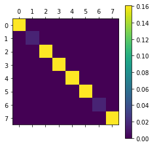
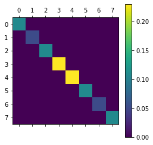
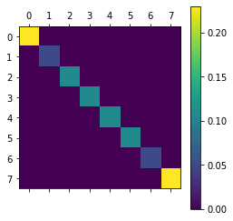

# Micrososft Challenge!

# Team QQT

### Part 1: Warmup tasks
Solutions to Part 1 of this challenge can be found in the folder [Part1](./Part1).
* [Task 1. Implementing a quantum oracle (Q#)](./Part1/Task1_QuantumOracleQsharp.ipynb) 
* [Task 2. Submitting Azure Quantum jobs from Q# Jupyter Notebooks (Q# + IonQ simulator)](./Part1/Task2_DeutschAlgorithmQsharpIonQ.ipynb)
* [Task 3. Submitting Azure Quantum jobs from Python Jupyter Notebooks (Qiskit + Quantinuum emulator)](./Part1/Task3_QrngQiskitQuantinuum.ipynb)

### Part 2: Free-form project
For part 2, we have implemented the Variational Quantum Thermalizer(VQT) and noise-induced VQT for 3 qubit Sherrington Kirkpatrick (SK) model of spin glass. We try to reach the thermal state of the SK model for temperature=1
 
VQT for 3 qubit SK model can be found in  the folder [Part2](./Part2) in the file 3qubitSK_Model_VQT.ipynb

A noise-induced VQT for 3 qubit SK model can be found in  the folder [Part2](./Part2) in the file Noisy3qubitSK_Model_VQT.ipynb

### Blog post for the free form project
We have written a blog post elucidatiing our project.
The blog post can be found here: https://legacyftw.github.io/blog/vqt/vqt.md/

## Results
Target state
Expectation Value: (-0.5033432861349194+0j)

Entropy: (1.898337128267965-0j)

Final Cost: (-2.4016804144028843+0j)

VQT results

Final Entropy: 1.950094553660756

Final Expectation Value: -0.3376905843085512

Final Cost: -2.287785137969307

Noise induced VQT results

Final Entropy: 1.950102534136878

Final Expectation Value: -0.33768274199267745

Final Cost: -2.2877852761295556

